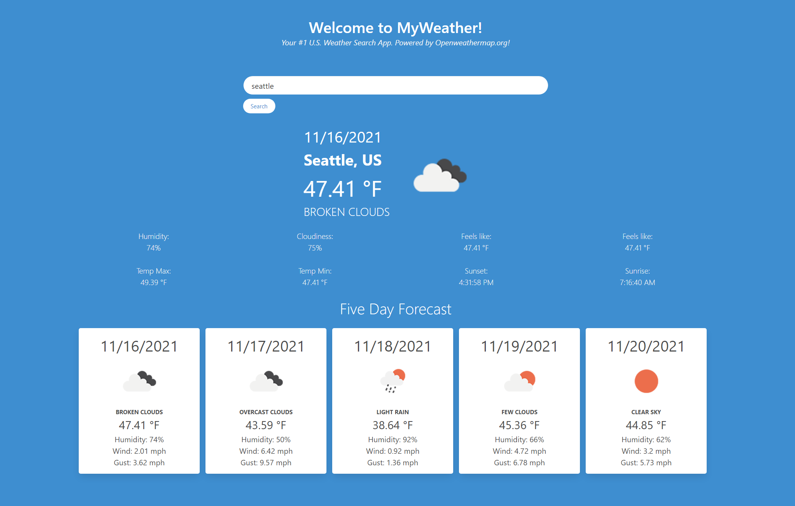

# MyWeather
Your one stop U.S. Weather News!
Powered by [https://openweathermap.org/](https://openweathermap.org/)

[Live Demo](https://my-weather-one.vercel.app/)

Usage: user can find local temperature via browser's geolocation function and, also, do query search across U.S. cities.

Built with: Bulma, dotenv, moment, and axios.